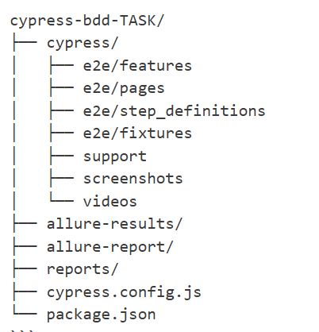

# Cypress BDD Testing Framework for ParaBank

## Overview

End-to-end testing framework using **Cypress** and **Cucumber BDD** for ParaBank web application with Allure and Cucumber HTML reporting.

## Tech Stack

* Cypress 13.10.0
* Cucumber BDD (@badeball/cypress-cucumber-preprocessor)
* JavaScript ES6+
* Allure Reports (@shelex/cypress-allure-plugin) + Cucumber base report[Supports multi reporting]
* Page Object Model (POM)
* Faker.js
* Terminal report api logging

## Project Structure



## Installation

```bash
git clone <repo-url>
cd cypress-bdd-TASK
npm install
npx cypress verify
```

## Running Tests

```bash
npm run test:parabank
npm run test:parabank:allure
npm run test:smoke:allure
npm run cy:open
```

## Reporting

```bash
npm run test:allure:report
npm run test:cucumber
npm run reports:clear
```

## Test Scenarios (Summary)

| Precondition          | Steps                             | Expected Result                                                      | Status                       | Tags                         |
| --------------------- | --------------------------------- | -------------------------------------------------------------------- | ---------------------------- | ---------------------------- |
| User is on login page | Enter valid credentials and login | Login successful, welcome message displayed, redirected to dashboard | Pass                         | @smoke @login @parabank      |
| User is on login page | Enter invalid credentials         | Error shown, login rejected                                          | Pass                         | @negative @login @parabank   |
| User is on login page | Click login with empty fields     | Validation errors, remain on login page                              | Pass                         | @validation @login @parabank |
| User is logged in     | Navigate to Accounts Overview     | All balances retrieved, total calculated, results logged             | Pass                         | @smoke @accounts @parabank   |
| User is logged in     | Logout                            | Redirected to login, session terminated                              | Pass                         | @smoke @logout @parabank     |
| User is logged in     | Logout and try protected page     | Should be redirected to login, session terminated                    | Fail [Unhandled status code] | @logout @security @parabank  |


## Author

**Nifaanya - Test Automation Engineer**

Screenshot 
Allure report: 


TestCases results 

